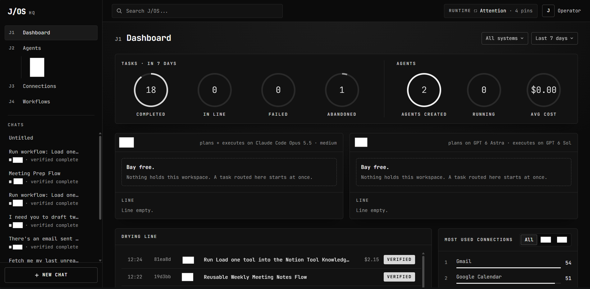

# J/OS HQ

**A local command center that runs AI agents across two businesses, with an approval gate on everything that leaves the machine.**

J/OS is an orchestration system built on [One](https://www.withone.ai),
Claude Code and the Codex CLI. You type a request once. J/OS works out which business it belongs to,
plans it against the real connected systems, and hands it to an executor agent. The agent works in
that business's own workspace, under that business's own account. HQ is the web app that makes this
visible and safe: it routes, queues, plans, gates, verifies and logs every task.

This repository is the HQ application. It is published as a portfolio project: the code is real
and running daily. People, companies and connection names in it are stand-ins.

---

## What it does

- **Routes every request to the right business.** Two executor workspaces (here called **One** and
  **Studio**) each authenticate as a different account. HQ routes on named people and entities,
  named workflows, and which workspace actually holds a live connection for the platform the task
  needs. If that still leaves any doubt, it asks. It never guesses, because a wrong guess runs live
  actions against the wrong organization.
- **Plans before it acts.** Each new task gets a read-only planning session inside the target
  workspace. The session inspects real connections, looks up every action's documentation, and
  returns a structured plan. HQ then checks the plan against the environment: a step the planner
  never looked up is flagged, and a connection that isn't live is caught.
- **Gates side effects.** Every external write (send, create, delete, publish, charge) is dry-run
  first. The operator sees the exact payload and approves it, and only that approved payload runs,
  exactly once. HQ enforces this in code: executors reach platforms only through a gateway that
  refuses unapproved writes.
- **Pins runtimes and proves them.** Each workspace runs a fixed harness, model and reasoning
  effort. HQ checks every launch against the pin, and if a pin is unavailable it blocks rather than
  quietly substituting another model.
- **Runs one task at a time per workspace.** Each business has its own line, the two businesses
  never wait for each other, and the line survives restarts.
- **Keeps a real record.** Every task is logged twice, when it is routed and when its result has
  been evaluated, in plain Markdown logs per business. An interrupted task is never reported as done.
- **Sub-agents with enforced scope.** Operators build agents from two answers: which connections
  and how to use them. HQ writes the operating procedure and guardrails itself, and allows each
  agent only its own connections, in code.
- **Workflows are One Flows.** Multi-step automations are built, validated and dry-run as One Flow
  dependency graphs, not shell scripts.
- **Submit issue.** A failed task can be reported as a GitHub issue. HQ scrubs names, emails,
  connection names and IDs from the report, and the operator previews and edits it before it is filed.

## Architecture

```text
                    Operator (browser, 127.0.0.1:4610)
                                  |
                              J/OS HQ  (Next.js app, SQLite telemetry, Markdown logs)
     understand -> route -> check logs -> plan (read-only) -> validate -> prompt -> dispatch
                                  |
              +-------------------+-------------------+
              |                                       |
       JOS/One  workspace                      JOS/Studio  workspace
       Claude Code executor                    Codex CLI executor
       own One account                         own One account
              |                                       |
        One gateway (dry-run, approval, exactly-once execution, connection scope)
              |                                       |
                      One CLI  ->  third-party platforms
```

The design rests on a few decisions:

| Decision | Why |
|---|---|
| The workspace folder is the account boundary | The One CLI resolves credentials by working directory, so HQ checks `projectRoot` and the account email before every write. A mismatch blocks rather than warns. |
| The planner is reasoning; the environment is truth | A plan is checked against live connections and against the gateway's record of which actions were actually looked up. |
| Approval is enforced, not requested | The gateway dry-runs every action to learn the real request, and refuses any write that isn't an approved, hashed payload. |
| Tool success is not objective success | A task is complete only after its outcome is verified: sent-message IDs, a read-back of the created record, and the terminal event of a flow run. |

## Stack

- **App:** Next.js 16, React 19, TypeScript, Tailwind CSS 4
- **State:** Node's built-in SQLite (WAL) for telemetry, and Markdown logs as the durable record
- **Executors:** Claude Code (One workspace), Codex CLI (Studio workspace)
- **Integrations:** One CLI (actions, flows, relay), reached only through HQ's gateway
- **Tests:** Vitest (unit and integration), Playwright (end to end, against a fake One CLI)

## Layout

```text
jos-hq/
  app/            pages: dashboard, chats, tasks, agents, connections, workflows
  components/     the UI (a darkroom theme: greyscale and one amber accent)
  lib/server/     orchestrator, routing, planning, dispatch, approvals, queue, logs, issues
  gateway/        the One gateway and guard that executors run behind
  bin/jos.mjs     CLI: dispatch a prepared prompt through HQ
  tests/          unit, integration and e2e suites
  DESIGN.md       the design system
```

## Running it

HQ expects to live at `JOS/jos-hq`, next to its two workspaces, each with its own One CLI project
config (`one init` in each folder, project scope):

```text
JOS/
  jos-hq/     this app
  One/        executor workspace A
  Studio/     executor workspace B
```

```powershell
cd JOS/jos-hq
npm install
npm run build
npm run start          # http://127.0.0.1:4610
npm test               # unit and integration
npm run test:e2e       # end to end, against a fake One CLI
```

Set the expected account for each scope, and the runtime pins, in `jos-hq/jos-hq.config.json`.
The values here are placeholders. HQ binds to `127.0.0.1` only, and every mutation needs a
same-origin request with its own header.

## License

All rights reserved. You may read the code and run it privately to evaluate it; reuse needs
permission. See [LICENSE](LICENSE).

---

Built by Jan Manalo ([@janmm97](https://github.com/janmm97)). 